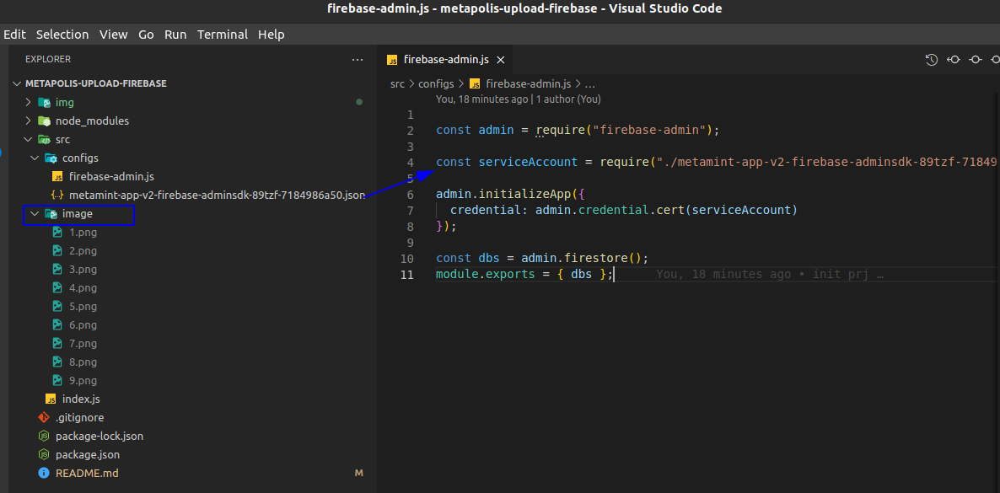
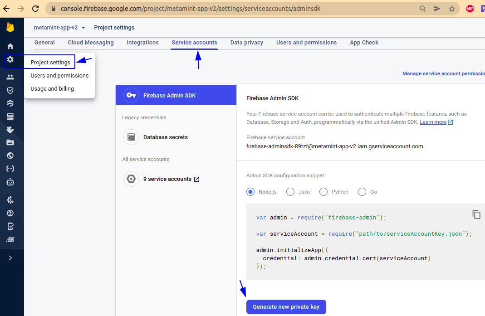
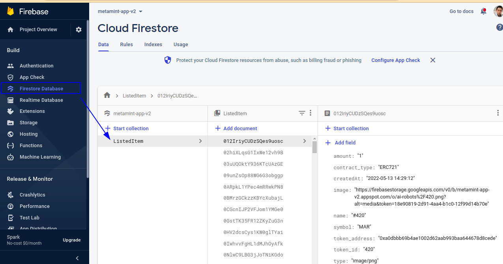
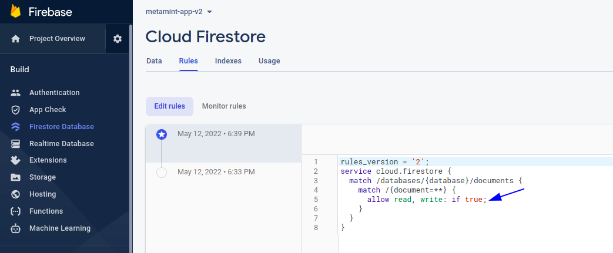
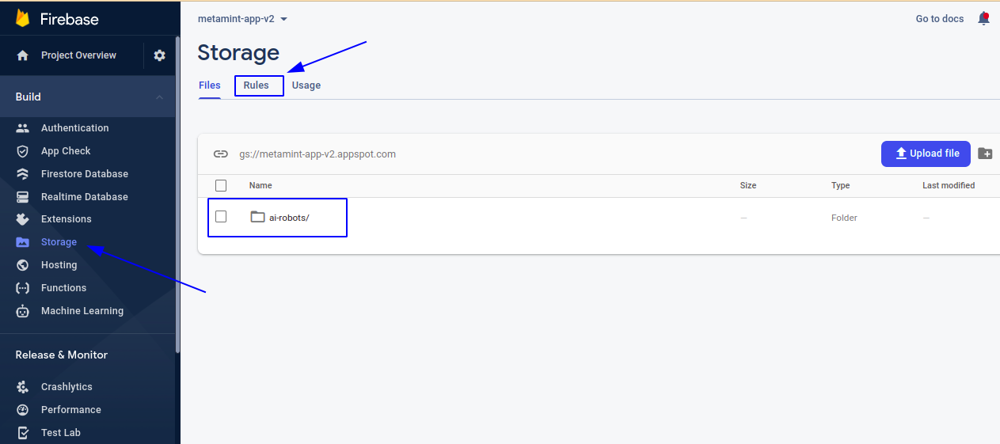

# Metapolis Server

### Project structure

- image: store the images to upload to firebase

### Generate metamint-app-v2-firebase-adminsdk-89tzf-7184986a50.json file

## Firebase 

### Firestore Database

- Create collection 

- Change from 'false' to 'true' in the Rule tab

### Storage

- Create the folder and named 'ai-robots'. 
- Change from 'false' to 'true' in the Rule tab

